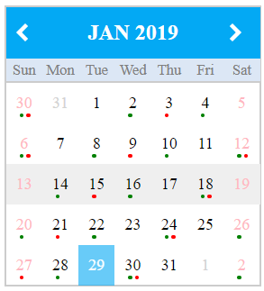

# PetitCalendar

Angular small localization calendar.



## Installation

npm install petit-calendar --save

## Usage
### * Import PetitCalendarModule in the component module

```
  import { PetitCalendarModule } from 'petit-calendar';
```

```
  imports: [
    ...
    PetitCalendarModule
  ]
```

### * To use PetitCalendar component

```
  <ngp-petit-calendar></ngp-petit-calendar>
```

Properties:
```
  @Input()
  locale = 'en';
  // locale code

  @Input()
  viewDate = new Date();
  // the date to display

  @Input()
  indicator = false;
  // each day has two event indicators below the day number
  // true to use event indicators, set the indicators using PetitcalendarService

  @Input()
  highlightSelectedDate = false;
  // true to highlight the selected date

  @Input()
  highlightSelectedWeek = true;
  // true to highlight the selected week

  @Output()
  changeViewDate = new EventEmitter<Date>();
  // emit the selected date after selecting the date

  @Output()
  changeViewMonth = new EventEmitter<Date>();
  // emit the first date of the month when clicking 'previous' or 'next'
```

### * Use PetitCalendarService to get the current calendar

* import PetitCalendarService
```
  import PetitCalendarService from 'petit-calendar';

  ...
  providers: [
    ...,
    PetitCalendarService
  ]
```

* inject PetitcalendarService
```
  ...
  constructor(
    ...,
    private calendarService: PetitCalendarService
  ){

  }
```

* get the current calendar
```
  this.calendarService.getCalendar().subscribe(
    (calendar: Calendar) => {
      // set day indicators
      calendar.days.forEach(day => {
        day.indicators.first = (condition);  // green color, indicate the day contains available time slot
        day.indicators.second = (condition); // red color, indicate the day contains booked time slot
      });
    }
  );
```

## License

MIT
